# Search in the era of AI Agents: local tools for privacy, understanding (and fun)
## An MCP + Agentic Retrieval workshop

*PyCon Italy 2026* · 2-hour hands-on

> Repo: https://github.com/coffepowered/pycon-italy-workshop-agentic-search

## About me

- Andrea Ruggerini (GH *@coffepowered*)
- I build Search and AI things at Soource, day to day
- Why this workshop: retrieval is a tool. It makes the LLMs truly useful.
- Find me after for questions, the repo, and the slides

## What you'll get out of today

- This is a workshop, it'll be an **hands-on** experience
- But I will give also *framing and resources*. I mean, things I find valuable
- Build **Retrieval** tools to **enhance** the experience we have in knowledge work (not strictly coding, LLMs are great at coding, and we know that)
- Once done, you'll
    - have experienced firsthand a few retrieval techniques and their use cases, pros and cons
    - have a feel for *which technique fits which question* — and why eval is what drives improving them

# Motivation [8m]

> ⏱️ *Keep this brisk — it's framing, not the main course.*

Some personal

- Consuming information is not enough.
- Our knowledge base is our second brain

Some professional
- Useful patterns for work
- Work seems to be shifting towards building tools

## Old world vs New world

| | Old world | New world |
|---|---|---|
| **Privacy** | data stayed local, we cared | prompts & files shipped to a cloud — do we still? |
| **Energy** | a search was practically free | every answer burns GPU time — do we care? |
| **Information** | hard to *obtain* | trivial to obtain, rarely *consumed* |

Yet, powerful LLMs are here to stay (and to improve)

# MCP: Intro & set-up [12m]

## MCP in this Workshop
This is *not* a workshop about MCP, *but* we'll build an MCP interface for our Retrieval tools.
Why?
- We are Host/Client independent :), so you can use the tool you want
- MCP is standard in the industry, worth using it
- The Python MCP toolkit has a nice inspector

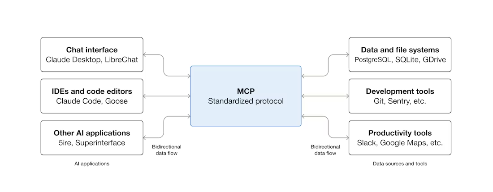

## MCP: definition and resources

> MCP (Model Context Protocol) is an open-source standard for connecting AI applications to external systems. Using MCP, AI applications like Claude or ChatGPT can connect to data sources (e.g. local files, databases), tools (e.g. search engines, calculators) and workflows (e.g. specialized prompts)—enabling them to access key information and perform tasks.

Resources:
- [Introduction](https://modelcontextprotocol.io/docs/getting-started/intro)
- [Participants](https://modelcontextprotocol.io/docs/learn/architecture)
- [Advanced: Sessions](https://modelcontextprotocol.io/specification/2025-06-18/basic/transports#session-management) (we won't use it, but...)

## MCP: Participants

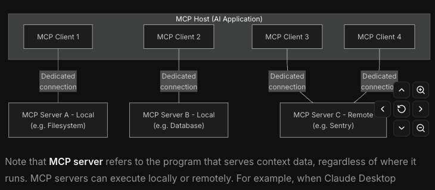, find more on the [architecture page](https://modelcontextprotocol.io/docs/learn/architecture)

## MCP: primitives

> MCP primitives are the most important concept within MCP. They define what clients and servers can offer each other. These primitives specify the types of contextual information that can be shared with AI applications and the range of actions that can be performed.

**Three core primitives** that servers [can expose](https://modelcontextprotocol.io/docs/learn/architecture):
1. *Tools*: Executable functions that AI applications can invoke to perform actions (e.g., file operations, API calls, database queries)
2. *Resources*: Data sources that provide contextual information to AI applications (e.g., file contents, database records, API responses)
3. *Prompts*: Reusable templates that help structure interactions with language models (e.g., system prompts, few-shot examples)

## MCP: Q

<div id='question_mcp_1' style="background-color:rgba(0, 0, 0, 0.0470588); text-align:center; vertical-align: middle; padding:40px 0; margin-top:30px">
You are building a MCP server to provide recipes from a book.
Which kind of primitive are you using and why?
</div>

## A minimal stack, on purpose

We use the **minimal set of libraries** to avoid un-necessary abstractions — no
heavyweight RAG framework (LangChain/LlamaIndex) hiding what's going on. The
whole workshop runs on five small, composable pieces:

- `pymupdf` — read & render PDF pages
- `lancedb` — the *one* store: BM25 full-text **and** multi-vector search
- `mlx-embeddings` — ColQwen2.5 embeddings, locally on Apple Silicon
- `fastmcp` — expose the tools over MCP
- `pydantic` — typed I/O the host can serialize for free

The point is to *see* the retrieval, not the framework.

## Get set-up

Three things and we're ready to go:

**1. The workshop repo** (the MCP server + scripts)
```shell
git clone https://github.com/coffepowered/pycon-italy-workshop-agentic-search
cd pycon-italy-workshop-agentic-search
uv sync
```

**2. A harness with an MCP client** — I'll use [codex cli](https://developers.openai.com/codex/cli) (it's Apache-licensed). The free plan is enough for the workshop.
```shell
npm install -g @openai/codex
```

**3. The sample KB** (it's a PDF) — download it and drop it into the `documents/` folder.
> https://drive.google.com/file/d/1f4skbLlesutOawKFX6_xQYxJh4fO-0eO/view?usp=sharing


Optional but fun — track how many tokens we burn as we go:
```shell
bunx ccusage codex session --color --since 2026-05-30
```
(omit `codex` to see all sessions, or use your favourite host/LLM)

## We start with one tool already wired

`server.py` ships with **one built-in tool** — a PDF *viewer*:

```python
get_page_for_llm(pdf_path, page, mode="text" | "image")
```

- `mode="text"` → the page text (cheap)
- `mode="image"` → the page rendered as a PNG (for layout, tables, figures)

Register the server in Codex, then sanity-check the host can actually call it. Each exercise below **adds one more tool** to this same server (the stubs are already in `server.py`).

# Exercise 1: Is grep all we need? [15m]

Add the first retrieval tool — `grep_documents` (the stub is in `server.py`). Then ask Codex:

<div id='question_intro_1' style="background-color:rgba(0, 0, 0, 0.0470588); text-align:center; vertical-align: middle; padding:40px 0; margin-top:30px">
Ho voglia di una salsa con le acciughe, cerca tra i miei files
</div>

- Watch what the agent actually does. Does it find it? How?
- **How many tokens** did it burn? (Remember to track usage :))
- Hold on to that number — we'll try to beat it later.

# A deep dive on recent (Agentic) Retrieval results [10m]

Three things I want you to leave with:
1. **Evaluation is important.**
2. We have a benchmark for industrial-grade agentic search, others for document VQA — but for *personal* uses, the judge is *you*.
3. **Efficiency is a thing** for speed (*and* for the planet).

## Retrieval intro

Given a query q and a corpus C = {d₁, d₂, …, dₙ}, retrieval is the task of returning an ordered list of documents D ⊂ C such that documents are ranked by estimated relevance to q.

Formally, a retriever learns a scoring function:

score(q, d) → ℝ, used to rank all d ∈ C

A document is relevant if it contains information that satisfies the information need expressed by q. Relevance is graded (highly relevant / partially relevant / non-relevant) and assessed by human judges.
Properties a retrieval system must balance:

* Effectiveness: does it surface the right documents?
* Efficiency: can it do so over millions/billions of documents in milliseconds?
* Generalization: does it work on unseen domains and query types?

## Retrieval Metrics

All metrics assume a ranked list of k returned documents and binary or graded human relevance judgments.

| Metric | What it measures | Intuition / formula |
|---|---|---|
| **Precision@k** | fraction of the top-k that are relevant | rel. docs in top-k / k |
| **Recall@k** | fraction of all relevant docs found in top-k | rel. docs in top-k / total rel. docs |
| **NDCG@k** ⭐ | graded relevance + a position discount | rewards putting the *most* relevant docs *highest* |

(Precision and recall trade off; NDCG is the one to watch when *ranking order* matters.)

## Retriever as a tool for agentic search

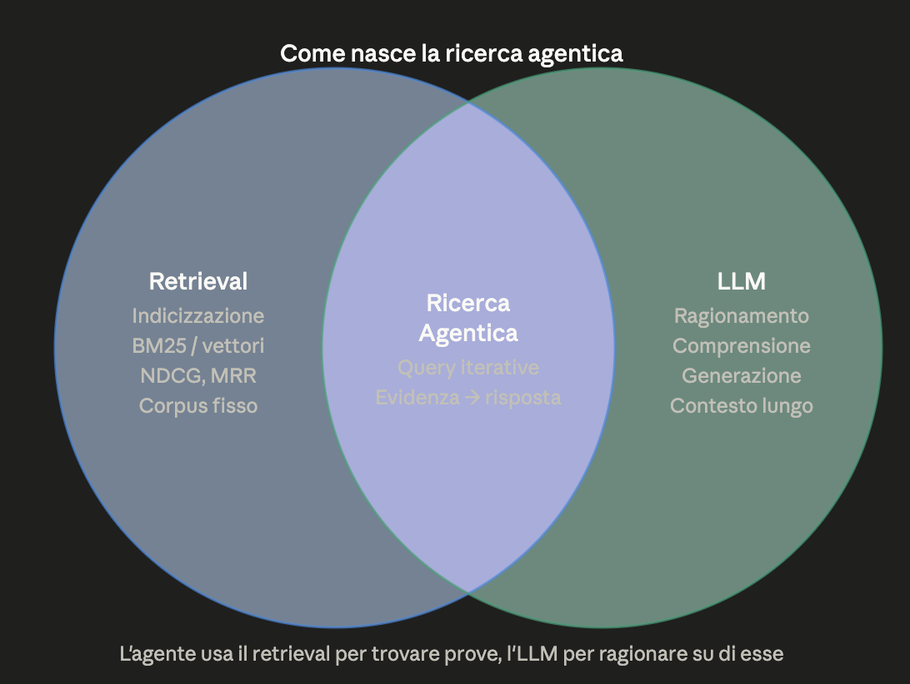


## Benchmark: example question
<div id='question_retrieval_en' style="background-color:rgba(0, 0, 0, 0.0470588); text-align:center; vertical-align: middle; padding:40px 0; margin-top:30px">
"A late 19th-century mock-heroic poem describes three Roman deities—two male and one female—stopping to rest at the 'Corona' inn in a town historically contested by Bologna and Modena. If a one-eyed innkeeper created a famous ring-shaped stuffed pasta by peeping through a keyhole and imitating the navel of the sole female deity among the three, what is the name of this goddess, and what was the primary profession of the Florentine-born author who wrote this poem?"
</div>
<br/>
<div id='question_retrieval_it' style="background-color:rgba(0, 0, 0, 0.0470588); text-align:center; vertical-align: middle; padding:40px 0; margin-top:30px">
La Domanda (Versione Italiana)
"Un poemetto eroicomico di fine Ottocento descrive tre divinità romane — due maschi e una femmina — che si fermano a riposare alla locanda 'Corona' in una cittadina storicamente contesa tra Bologna e Modena. Se un oste guercio creò una celebre pasta ripiena a forma di anello spiando dal buco della serratura e imitando l'ombelico dell'unica divinità femminile tra le tre, qual è il nome di questa dea, e qual era la professione principale dell'autore di origini fiorentine che ha scritto questo poema?"
</div>

## What does it take

To solve a question like this?

## What LLMs *can* do — and why they keep getting better

A question like this *is* solvable today, and the answers keep improving fast. Why?

- Modern LLM agents **iterate**: search → read → reason → search again — genuinely multi-hop.
- The key unlock for *research*: you can **separate the retriever's contribution from the agent's**. Is a wrong answer a *retrieval* miss (never found the doc) or a *reasoning* miss (had the doc, blew the inference)?
- Measuring those **two halves independently** is what drove a lot of recent progress — you improve the weak half instead of guessing.
- That separation is exactly what a controlled-corpus benchmark like BrowseComp-Plus gives us 👇

## BrowseComp-Plus : Intro

BrowseComp-Plus (ACL 2026) is a fixed-corpus benchmark for evaluating deep-research agents. They are LLMs that iteratively issue search queries, retrieve documents, and reason over results to answer complex, multi-hop questions.

Problems with vanilla BrowseComp:
- Relies on live, black-box web APIs (Google/Bing) → non-reproducible
- Can't isolate retriever failures from reasoning failures: the two are entangled
- Different runs see different web states → no fair comparison

## BrowseComp-Plus : A controlled corpus
Fixed corpus: 100,195 human-verified documents, built in two stages:

Automated evidence gathering: o3 collects candidate supporting documents for each of the 830 BrowseComp queries
Human verification: annotators confirm true positives and label relevance
Hard-negative mining: semantically similar but non-answering documents are added to stress-test retrievers

Each query ships with both gold documents and hard negatives, enabling isolated evaluation of **retriever** and **agent components** independently.

## BrowseComp-Plus : Original Results

The benchmark measures **two components independently**:

| Component | What's measured |
|---|---|
| **Agent (LLM)** | end-to-end answer accuracy over the fixed corpus — how well it searches & reasons |
| **Retriever** | how well it surfaces the *gold* docs — isolated from the agent |

Benchmark numbers (with a **BM25** retriever):

- **Search-R1** (open-source): **3.86%** accuracy
- **GPT-5**: **55.9%** accuracy

**Retriever swap matters:** GPT-5 + Qwen3-Embedding-8B retriever → **70.1%** accuracy, with *fewer* search calls — showing retriever quality is a first-class variable the benchmark can now isolate.

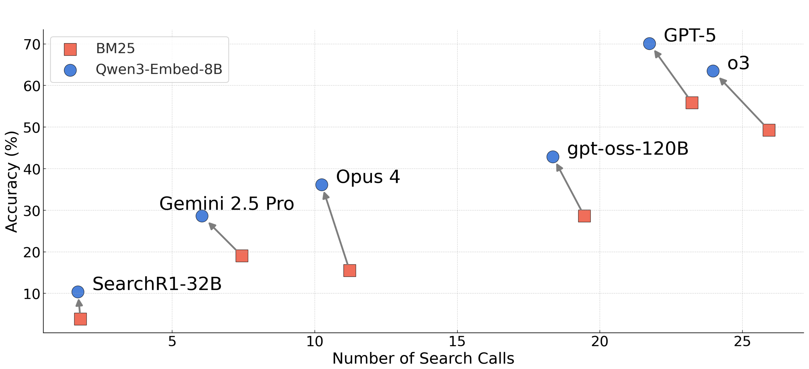
from [here](https://github.com/texttron/BrowseComp-Plus)


## BrowseComp-Plus : My take
Reproducible research is as needed as open source software!
Even ""tiny"" local models are getting good... Yet that's not the whole story
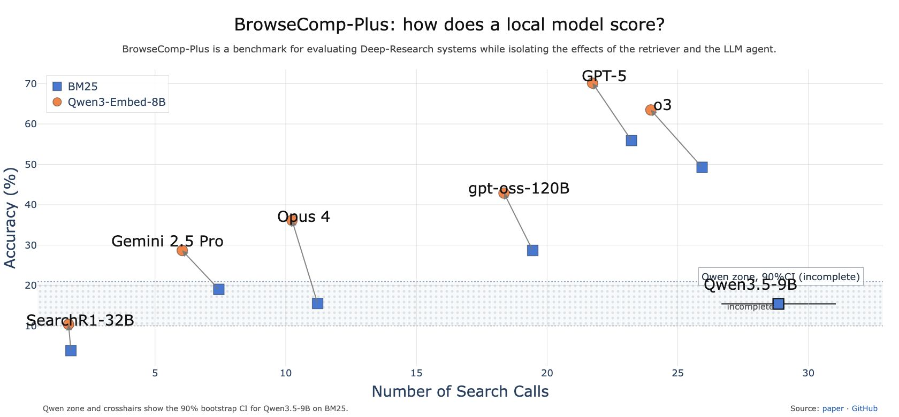

In a **personal experiment of mine**, it took ~**800k tokens** on average to reach that score (!) — a number I trust because I measured it myself.
Good, but impractical.

## BrowseComp-Plus: Recent Results
Recent improvements:
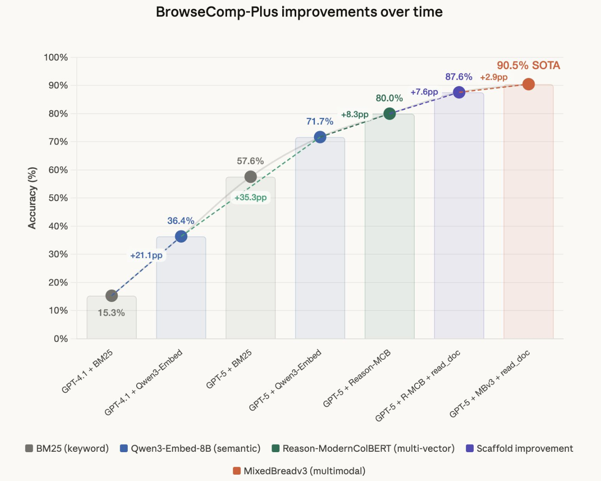

(here's a HF [leaderboard](https://huggingface.co/spaces/Tevatron/BrowseComp-Plus))

## BrowseComp-Plus: The cost of reproducibility

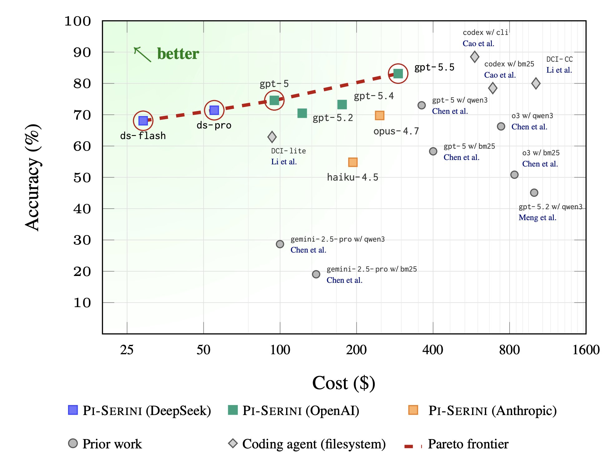

# Text Ranking: Intro to BM25 [10m]

Def from [wikipedia](https://en.wikipedia.org/wiki/Okapi_BM25)
In information retrieval, Okapi BM25 (BM is an abbreviation of best matching) is a ranking function used by search engines to estimate the relevance of documents to a given search query. It is based on the probabilistic retrieval framework developed in the 1970s and 1980s by Stephen E. Robertson, Karen Spärck Jones, and others. [...]

BM25 is a bag-of-words retrieval function that ranks a set of documents based on the query terms appearing in each document [...]

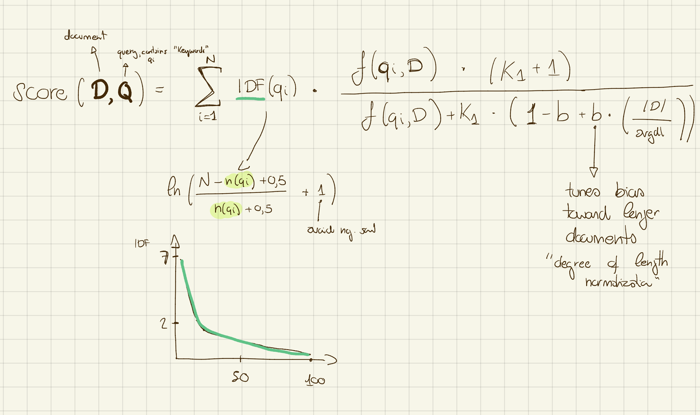

## Modern BM25 software
- A barebone bm25 index ranges starts at about 25% the size of the text (rule of thumb). Expect more in applications.
- engines supporting BM25 tipically have very interesting features for text search (tokenizers, phrase search, n-grams...)

Let's take a look at LanceDB. In a notebook, like in the good old days. Go to:
> scripts/lance_fts.py

# Exercise 2: BM25 search [20m]

## Exercise 2
Remember to track usage :)
- Implement the `search_documents_bm25` tool (stub in `server.py`).
- Remember that there's the index building phase as well!

Then ask Codex:

<div id='question_bm25' style="background-color:rgba(0, 0, 0, 0.0470588); text-align:center; vertical-align: middle; padding:40px 0; margin-top:30px">
polpette di carne lessata avanzata
</div>

Are you done?

## Exercise 2

How long (and how many tokens) did it take to find
> polpette di carne lessata avanzata

with our new tool versus grep in Exercise 1?

## Is BM25 the solution for deep research?
Who knows, but people are talking about this: https://arxiv.org/abs/2602.21456

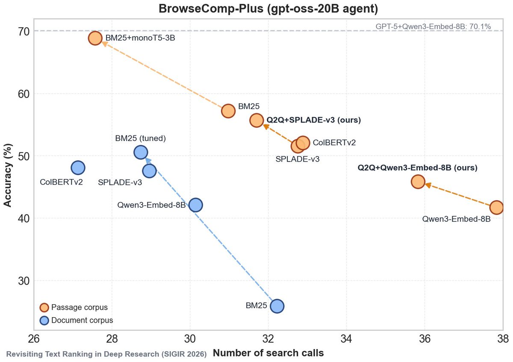

From Doug Turnbull's [newsletter](https://www.youtube.com/watch?v=UXQ916WRK0A), elaborated from [this](https://arxiv.org/abs/2602.21456) paper

# Brief notes about vector retrieval [10m]

## Brief notes about vector retrieval

Moving from **lexical** to **semantic** ranking

- BM25 matches **surface tokens**: exact words, no understanding of meaning
- "car" and "automobile" are different tokens to BM25, full stop
- **vector / dense retrieval** instead encodes *meaning* into numeric vectors
- an **embedding model** maps query and document into the *same* vector space
- ranking is then just **vector similarity** (e.g. cosine) — nearest neighbours win
- **sparse** (BM25): high-dimensional, mostly zeros, one weight per term
- **dense**: a few hundred/thousand floats, every dimension carries signal
- not either/or — in practice you often combine both (hybrid)
- and there are different **flavors** of vector retrieval:
  - **single-vector** (bi-encoder) — one vector per document
  - **late-interaction / multi-vector** — one vector per token
- the next slides walk through both

## Single vector retrieval

We all know them from 2023/2024 RAG applications

Single vector retrieval, the **good**
- very easy to get started
- excellent results when fine-tuned on your domain
- automatically handles synonyms and "semantic" meaning
- indexing is well-known and understood

operations considerations
- behavior with filters
- "semantic" meaning is less interesting with powerful LLMs

the **bad**
- out-of-domain generalization
- similarity != relevance
- cramming 'everything' in a single vector

**Why they still rule production:** one vector per doc → search is a single ANN lookup. *Blazing* fast, tiny index, scales to billions of docs, dead-simple ops. For most apps that speed/cost/simplicity wins and fine-tuning closes most of the quality gap.


## Late interaction models

The core idea (ColBERT-style)

- bi-encoders crush a whole document into **one vector** — meaning gets compressed *before* the comparison
- late interaction keeps **one vector per token** instead of pooling them away
- at query time: for each **query token**, compute similarity against **every document token**
- keep only the **max** similarity per query token (**MaxSim**), then **sum** those maxima → relevance score
- token-level matching is also **explainable** — you can see *which* tokens matched

The three regimes

- **bi-encoder / single-vector** — fast, doc vectors precomputed, but **lossy** (everything in one vector)
- **cross-encoder** — query + doc through full cross-attention: very **accurate**, but you must run every doc at query time — **doesn't scale**
- **late interaction** — the **middle ground**: token-level expressiveness, yet doc vectors are still **precomputable** offline; only the query is encoded at runtime

The tradeoff

- better **out-of-domain generalization** and **precision** than single-vector
- the cost: a vector **per token** means a much **larger index / more storage** (even quantized, e.g. ColBERTv2, it costs more than one high-dim vector)

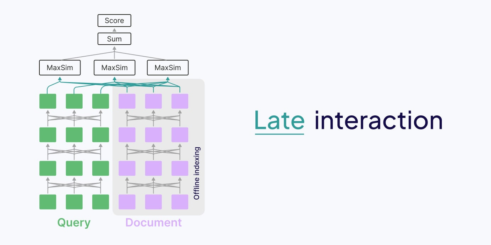

## Late interaction models: viz
The intuition behind late interaction

https://gemini.google.com/share/d01423c051fc

## Multimodal late interaction models

Have a clear advantage
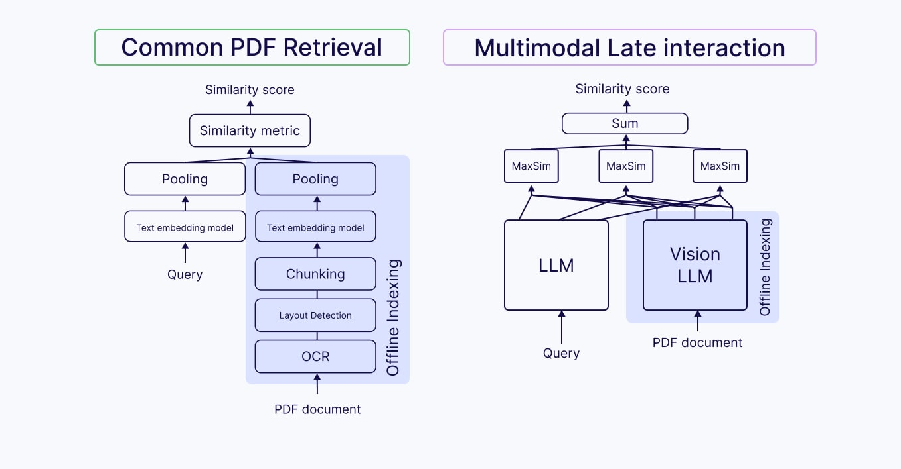

# Exercise 3 (optional): multimodal search

> 🧭 Optional — if the model is already downloaded and you're on Apple Silicon, give it a go. Otherwise we'll run it **together** as a demo. (Non-mac / text-only folks: pair up and watch.)

## Exercise 3 (optional)
Remember to track usage :)

**Goal**: implement the `search_documents_multimodal` tool — multimodal (ColQwen2.5)
search over the files. The model reads each page *as an image*, so it can match
figures, tables and layout that plain text extraction (BM25) never sees.

Same shape as BM25 — **one object** (`ColQwenIndex`) both builds and searches:
1. **Build** — render every *visual* page and embed it (text-only pages are skipped).
2. **Search** — MaxSim ranking; no ANN index needed at this scale, LanceDB does an exact flat scan.

```shell
# build the index (use -v to see per-page progress — it's silent otherwise)
uv run python -m solutions.indexer documents -v

# long PDFs are slow: cap pages per document to keep it cheap
uv run python -m solutions.indexer documents --max-pages-per-doc 5 -v

# build + query in one go
uv run python -m solutions.indexer documents --query "energy AI" --k 10 -v

# query an ALREADY-built index (skip indexing entirely)
uv run python -m solutions.indexer --no-build --query "energy AI" --k 10 -v

# re-index from scratch (after editing a file or tuning the heuristics)
uv run python -m solutions.indexer documents --force -v
```

Safe to **Ctrl-C and rerun** — it resumes from the next un-embedded page.

Then expose it as the MCP tool `search_documents_multimodal`.

## Exercise 3 (optional)

How long (and how many tokens) to find the page that *shows*

> lo schema di come la RAG è evoluta dal 2023 al 2026

i.e. a page whose answer is in a **diagram**, not in its words.
How does it compare to BM25 on the same question?

<div id='question_ex3' style="background-color:rgba(0, 0, 0, 0.0470588); text-align:center; vertical-align: middle; padding:40px 0; margin-top:30px">
Find data about the energy consumption of data centers.
</div>

# Conclusions [5m]

What we built, and what to take home:

- **Retrieval is a tool, not a framework.** A handful of libraries (`pymupdf`, `lancedb`, `mlx-embeddings`, `fastmcp`, `pydantic`) took us agentic grep → BM25 → multimodal late-interaction (no LangChain required).
- **The technique follows the question.** grep for exact strings, BM25 for lexical recall, late-interaction/multimodal for *meaning* and *layout* (diagrams, tables). Each exercise broke the previous query for a reason.
- **Efficiency is a first-class metric.** Speed and the planet both count, but we need quite large models to have good agentic search.
- **Agents and harnesses keep improving** but mental models, and the ability to *compose* tools, stay the durable skill, for agents (and humans).

- **Eval is what drives systematic improvement.** We didn't formalize one today, but every time a query *broke* a tool you saw exactly *why* that signal is what an eval set captures, turning "tweak and hope" into measurable improvement. The 5-line version one can build with a /goal:
    1. **Collect real queries**: log the questions you (or the LLM) actually ask your KB. Don't invent them.
    2. **Label a handful** — for ~20–50 queries, note which page/doc *should* come back. You are the judge.
    3. **Score your tools against it** — run grep / BM25 / multimodal, count hits@k. Now "better" is a number, not a vibe.
    4. **Optimize the weak half**: chunking, tokenizer, which retriever, the prompt. Re-run. Repeat.
- **Match the tool to the query you actually expect.** Most personal KB questions are *not* BrowseComp-style deep research — they're "where did I read X", a known fact, an exact phrase, a diagram. Build for *your* interests; deep research is just a cool reference, not the default. 

All of this runs **locally, today**, while **minimizing** what you expose and what you spend (data exposure, energy, inference cost).

# Additional Documents, to go deeper

- A full tour through RAG, document context, and AI agents - from 2023 to 2026 🌎🤖 @hexapode. [link](https://drive.google.com/file/d/1IQ7G0aEyQQNBaxTBFkJ6YD-xvPZ5QM67/view)
- Search for coding and pure text is... running fast, [even locally](https://huggingface.co/blog/lightonai/colgrep-lateon-code)
- Recent Retrieval Talk by @bclavie (mixedbread.ai). [Link](https://docs.google.com/presentation/d/1GmvpRgre2zamJ5zKxxhtj-eKL4j6VqfP3wO2_o210Z0/edit?slide=id.p#slide=id.p)
- This is what agentic retrieval look like. [Blog post](https://hornet.dev/blog/this-is-what-agentic-retrieval-looks-like) by Jo Bergum
